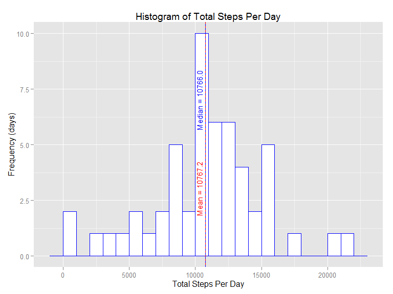
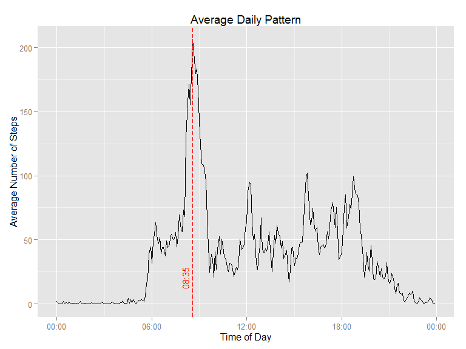
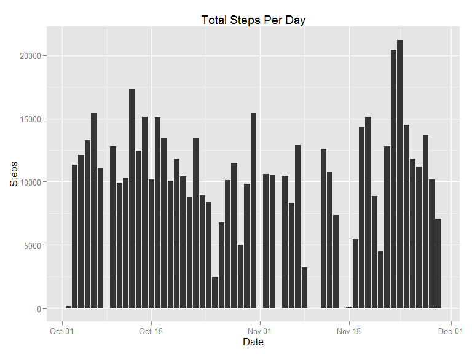
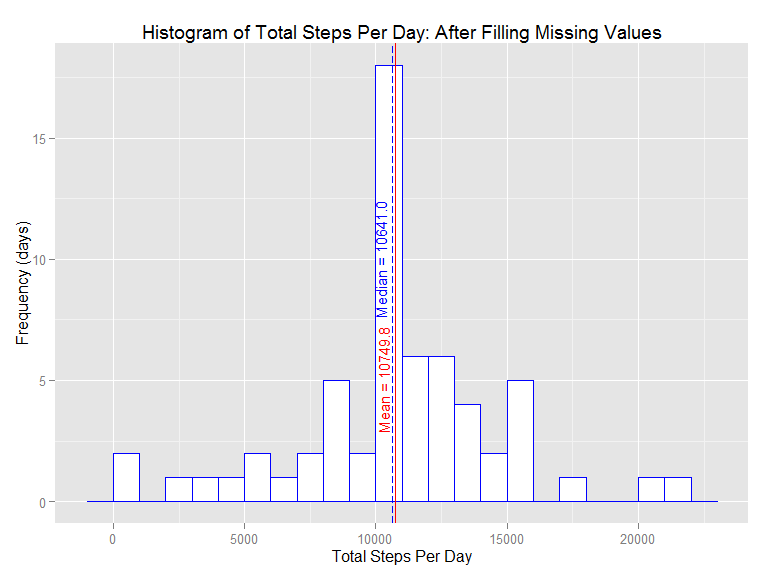
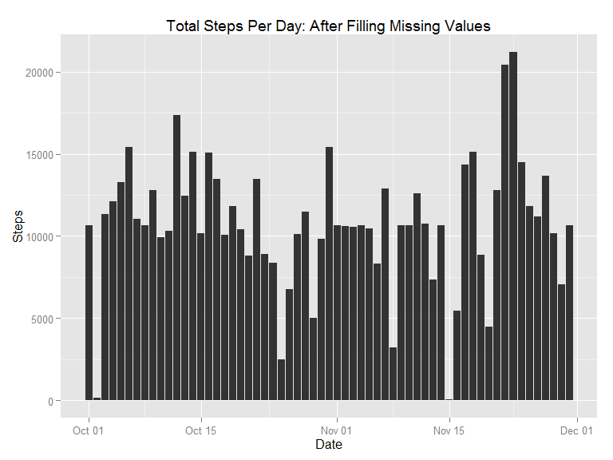
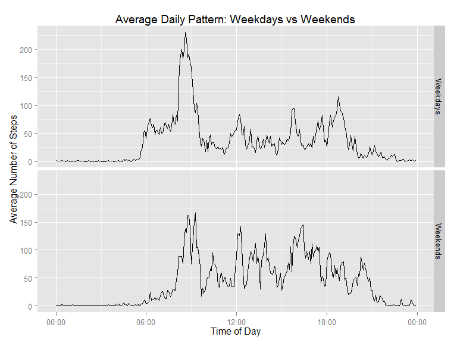

Reproducible Research: Peer Assessment 1
========================================

Author: David Currie  
Date: July 20, 2014  
This assignment makes use of data from a personal activity monitoring
device. This device collects data at 5 minute intervals through out the
day. The data consists of two months of data from an anonymous
individual collected during the months of October and November, 2012 and
include the number of steps taken in 5 minute intervals each day.

Loading and preprocessing the data
----------------------------------

The first step is to load and condition the data for analysis. The input
data is contained in a zip archive, so we will extract it to a comma
separated value (.csv) file then load it into a data.frame object. For
ease of analysis, the date and interval fields are combined and
converted to a POSIX date field.

    library(ggplot2)
    library(lubridate)
    library(scales)
    require(knitr)

    ## Loading required package: knitr

    opts_chunk$set( fig.path = 'figures/' )

    if(!file.exists('activity.csv')){
      unzip('activity.zip')
    }
    activity.dat<-read.csv('activity.csv')
    # make some date related fields to help with plotting
    activity.dat$Date<-as.Date(activity.dat$date)
    activity.dat$posdate<-as.POSIXct(strptime(paste(activity.dat$date,sprintf("%04d",activity.dat$interval),sep="-"),"%Y-%m-%d-%H%M"))
    activity.dat$wday<-wday(activity.dat$posdate,label=TRUE)
    # the interval value is actually a time, but if it is interpreted as an integer, the plots are wrong
    # make a time of day field
    activity.dat$tod<-activity.dat$posdate
    year(activity.dat$tod)<-2010
    yday(activity.dat$tod)<-1

What is the mean total number of steps taken per day?
-----------------------------------------------------

The following graph shows a histogram of the total number of steps taken
each day of the 61 days in the dataset.

    # compute the sums for each day, excluding the NA values
    step.sums<-sapply(unique(activity.dat$date),FUN=function(x) sum(activity.dat[activity.dat$date==x,'steps'],rm.na=TRUE))
    # calculate the summary statistics
    step.mean<-mean(step.sums,na.rm=TRUE)
    step.median<-median(step.sums,na.rm=TRUE)
    # make a dataframe for plotting
    summary.df<-data.frame(Date=as.Date(unique(activity.dat$date)),Steps=step.sums)
    # use ggplot to plot the histogram
    hplt<-ggplot(summary.df)
    hplt+stat_bin(binwidth=1000,aes(x=Steps),colour='blue',fill='white')+
      ggtitle('Histogram of Total Steps Per Day')+
      geom_vline(xintercept=step.mean,colour='red')+
      ylab('Frequency (days)')+
      xlab('Total Steps Per Day')+
      annotate("text",label=sprintf('Mean = %5.1f',step.mean),x=step.mean,y=3,angle=90,vjust=-.5,colour="red",size=4)+
      geom_vline(xintercept=step.median,colour='blue',linetype="dashed")+
      annotate("text",label=sprintf('Median = %5.1f',step.median),x=step.median,y=7,angle=90,vjust=-.5,colour="blue",size=4)

The above graph indicates that the most common number of steps in a day
was between 10000 and 11000, with 10 days reporting totals in that
range. There were two days with total number of steps in excess of 20000
but also two days with 1000 or fewer steps. The distribution appears to
be normal, with mean and median effectively equal.  
Mean number of steps per day: 10767  
Median number of steps per day: 10766

* * * * *

Note to reviewers: the statistics quoted above are computed in the
previous code chunk and generated in the text using inline R code. This
code is not echoed when the markdown is rendered. I use this technique
later in the report as well.

* * * * *

What is the average daily activity pattern?
-------------------------------------------

The following figure shows the average number of steps reported in each
5 minute interval throughout the day.

    # compute the means for each interval
    int.means.df<-data.frame(Interval=unique(activity.dat$tod), Steps=sapply(unique(activity.dat$interval),FUN=function(x) mean(activity.dat[activity.dat$interval==x,'steps'],na.rm=TRUE)),int=unique(activity.dat$interval))
    # find the interval corresponding to the maximum reading
    max.int<-int.means.df[which.max(int.means.df$Steps),]

    pplt<-ggplot(int.means.df,aes(x=Interval,y=Steps))
    pplt+geom_line()+scale_x_datetime(labels = date_format("%H:%M"))+xlab("Time of Day")+ylab("Average Number of Steps")+
      ggtitle("Average Daily Pattern")+
      geom_vline(aes(colour="Max",linetype="Max"),xintercept=as.numeric(max.int[1,1]),colour='red',linetype="longdash")+
      annotate("text",label=format(max.int[1,1],"%H:%M"),x=max.int[1,1],y=20,angle=90,vjust=-.5,colour="red",size=4)

As illustrated by the dashed red line, the time interval that had the
highest average number of steps was 08:35 which had an average number of
steps equal to 206.1698

Imputing missing values
-----------------------

The original dataset is missing data from some days. In this section we
will attempt to use a simple algorithm to estimate a value to be used in
these instances. First, we will determine how much data is missing and
how it is distributed. The following figure illustrates the total number
of steps reported for each day in the duration of the dataset.

    # the number of rows with missing data
    missing.count<-sum(is.na(activity.dat$steps))
    # the days with missing data
    missing.dates<-unique(activity.dat[which(is.na(activity.dat$steps)),'Date'])
    # the number of observations on the days with missing data
    missing.obs<-sapply(missing.dates,FUN=function(x) sum(!is.na(activity.dat[activity.dat$Date==x,'steps'])))

    hplt+geom_bar(aes(x=Date,y=Steps),stat='identity',na.rm=TRUE)+ggtitle('Total Steps Per Day')

    ## Warning: Removed 8 rows containing missing values (position_stack).

There appear to be 2304 rows with missing data, which occur on 8
separate dates. checking the data for those dates we find that they are
missing data for all intervals in the day. Using the previously
calculated average values for each interval, we can *fill in* the
missing values according to the interval in which they occur. Using this
approach, the histogram of total steps per day, shown below, differs
from the original in that the bin containing the mean indicates an
additional 8 days.

    # make a copy of the original data
    filled.dat<-activity.dat
    # figure out which rows need to be updates
    tobe.filled<-which(is.na(filled.dat$steps))
    # replace the NA value with the average for that interval
    filled.dat[tobe.filled,'steps']<-sapply(filled.dat[tobe.filled,'interval'],FUN=function(x) as.integer(int.means.df[int.means.df$int==x,2]))
    # plot the histogram
    filled.sums<-sapply(unique(filled.dat$date),FUN=function(x) sum(filled.dat[filled.dat$date==x,'steps'],na.rm=TRUE))
    filled.mean<-mean(filled.sums,na.rm=TRUE)
    filled.median<-median(filled.sums,na.rm=TRUE)
    filled.summary.df<-data.frame(Date=as.Date(unique(filled.dat$date)),Steps=filled.sums)
    filled.hplt<-ggplot(filled.summary.df)
    filled.hplt+stat_bin(binwidth=1000,aes(x=Steps),colour='blue',fill='white')+
      ggtitle('Histogram of Total Steps Per Day: After Filling Missing Values')+
      geom_vline(xintercept=filled.mean,colour='red')+
      ylab('Frequency (days)')+
      xlab('Total Steps Per Day')+
      annotate("text",label=sprintf('Mean = %5.1f',filled.mean),x=filled.mean,y=5,angle=90,vjust=-.5,colour="red",size=4)+
      geom_vline(xintercept=filled.median,colour='blue',linetype="longdash")+
      annotate("text",label=sprintf('Median = %5.1f',filled.median),x=filled.median,y=10,angle=90,vjust=-.5,colour="blue",size=4)

Looking at the mean and median values, there is a small change;

<table>
<thead>
<tr class="header">
<th align="left">Statistic</th>
<th align="left">Original</th>
<th align="left">Filled</th>
</tr>
</thead>
<tbody>
<tr class="odd">
<td align="left">Mean</td>
<td align="left">10767</td>
<td align="left">10750</td>
</tr>
<tr class="even">
<td align="left">Median</td>
<td align="left">10766</td>
<td align="left">10641</td>
</tr>
</tbody>
</table>

Comparing the daily pattern, we can see there is no change from the
un-filled dataset, which is what we would expect since this is the data
used to replace the missing values.

    filled.means.df<-data.frame(Interval=unique(filled.dat$tod), 
                                Steps=sapply(unique(filled.dat$interval),FUN=function(x) mean(filled.dat[filled.dat$interval==x,'steps'],na.rm=TRUE)),
                                int=unique(filled.dat$interval))

    filled.max.int<-filled.means.df[which.max(filled.means.df$Steps),]

    filled.pplt<-ggplot(filled.means.df,aes(x=Interval,y=Steps))
    filled.pplt+geom_line()+
      scale_x_datetime(labels = date_format("%H:%M"))+
      xlab("Time of Day")+
      ylab("Average Number of Steps")+
      ggtitle("Average Daily Pattern: After Filling Missing Values")+
      geom_vline(aes(colour="Max",linetype="Max"),xintercept=as.numeric(filled.max.int[1,1]),colour='red',linetype="longdash")+
      annotate("text",label=format(filled.max.int[1,1],"%H:%M"),x=filled.max.int[1,1],y=20,angle=90,vjust=-.5,colour="red",size=4)

Finally, comparing to the calendar view, it is interesting to note that
the remaining dates with low step counts appear to occur at a fairly
regular frequency.

    filled.hplt+geom_bar(aes(x=Date,y=Steps),stat='identity',na.rm=TRUE)+
      ggtitle('Total Steps Per Day: After Filling Missing Values')

Are there differences in activity patterns between weekdays and weekends?
-------------------------------------------------------------------------

Using the filled dataset from the previous section, we can compare
average activity patterns between weekends and weekdays.

    # add a weekend column to the filled dataset
    filled.dat$weekend<-sapply(filled.dat$wday, FUN=function(x) ifelse(x %in% c('Sat','Sun'), 1, 0))
    # now calculate the means for each interval, for both weekend and weekdays
    weekday.means.df<-data.frame(Interval=unique(filled.dat$tod), Steps=sapply(unique(filled.dat$interval),FUN=function(x) mean(filled.dat[filled.dat$interval==x & filled.dat$weekend==0,'steps'],na.rm=TRUE)),int=unique(filled.dat$interval),weekend=0)

    weekend.means.df<-data.frame(Interval=unique(filled.dat$tod), 
          Steps=sapply(unique(filled.dat$interval),FUN=function(x) mean(filled.dat[filled.dat$interval==x & filled.dat$weekend==1,'steps'],na.rm=TRUE)),
          int=unique(filled.dat$interval),weekend=1)
    # combine the two dataframes
    filled.means.df<-rbind(weekday.means.df,weekend.means.df)
    filled.means.df$weekend<-factor(filled.means.df$weekend,labels=c("Weekdays","Weekends"))

    filled.pplt<-ggplot(filled.means.df,aes(x=Interval,y=Steps))
    filled.pplt+geom_line()+
      scale_x_datetime(labels = date_format("%H:%M"))+xlab("Time of Day")+
      ylab("Average Number of Steps")+
      ggtitle("Average Daily Pattern: Weekdays vs Weekends")+
      facet_grid(weekend~.)

A comparison of the two traces would seem to support the conclusion that
the subject slept in more often on weekends and sometimes skipped their
morning exercise session, however they were more likely to be active
throughout the waking hours. On weekdays, the alarm clock appears to
ring before 6 AM.
